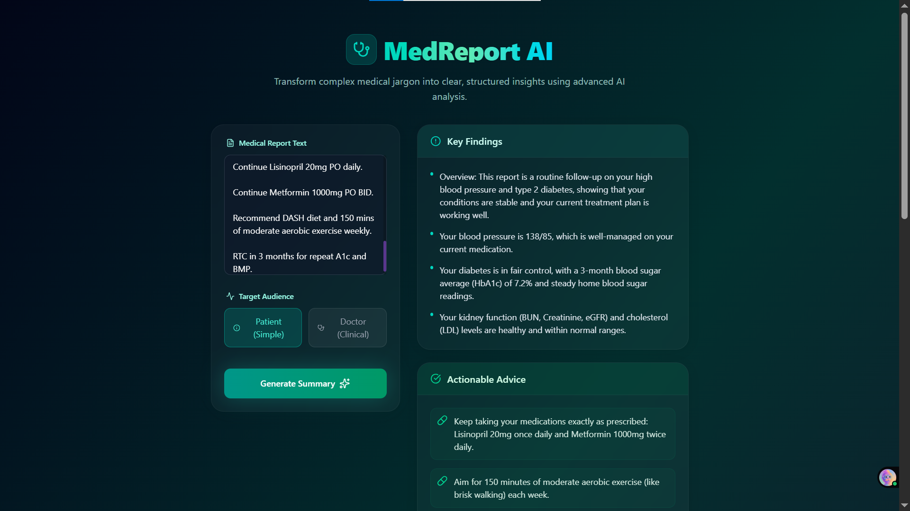
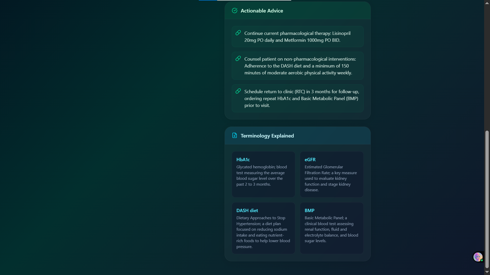

# ClinicaLens 🩺
## Decoding Healthcare Data: A Two-Way Agentic Framework for Doctors and Patients
ClinicaLens is an AI-powered medical text summarization platform built to eliminate information asymmetry in healthcare.
Powered by Gemini 2.5 Flash and the Google ADK (Agent Development Kit), the system acts as an intelligent semantic router that 
dynamically adapts its architecture based on the user persona.


Instead of generating a one-size-fits-all summary, ClinicaLens splits raw clinical data—such as unstructured notes, lab panels,
and radiology reports—into two tailored pathways:

* For Doctors: Instantiates a clinical scribe persona that strips away conversational filler, formats data into standard SOAP structures, retains precise medical jargon, and highlights critical out-of-range anomalies right at the top.

* For Patients: Instantiates an empathetic health educator persona that translates complex jargon into plain everyday language, organizing findings into clear consumer-friendly pillars (Key Findings, Actionable Advice, and Terminology Explained).

## Screenshots
<div style="display: flex; gap: 10px;">
  
  
</div>

## 📂 Project Repository Structure
The architecture maintains a strict separation of concerns, keeping core logic, prompt assets, and utilities completely modular:

```
ClinicaLens/
├── backend/
│   ├── my_agent/
│   │   ├── .adk/
│   │   ├── __pycache__/
│   │   ├── .env
│   │   ├── .gitignore
│   │   ├── __init__.py
│   │   └── agent.py
│   ├── .venv/
│   ├── adk_error.txt
│   ├── main.py
│   └── test_run.py
├── frontend/
│   ├── public/
│   ├── src/
│   │   ├── assets/
│   │   ├── App.jsx
│   │   ├── index.css
│   │   └── main.jsx
│   ├── node_modules/
│   ├── .gitignore
│   ├── eslint.config.js
│   ├── index.html
│   ├── package-lock.json
│   ├── package.json
│   └── vite.config.js
├── .git/
└── README.md

```

## 🚀 Technical Core: Agent Factory

ClinicaLens utilizes a functional Factory Pattern via the Google ADK to instantiate completely isolated runtime environments for each audience profile.
This guarantees tonal purity and prevents instruction leakage.


```python
from google.adk.agents.llm_agent import Agent
from prompts.instructions import DOCTOR_SYSTEM_INSTRUCTION, PATIENT_SYSTEM_INSTRUCTION

def create_medassist_agent(audience: str) -> Agent:
    normalized_audience = audience.strip().lower()
    
    if normalized_audience == 'doctor':
        return Agent(
            model='gemini-2.5-flash',
            name='medassist_doctor_agent',
            description='A clinical summarizer assistant optimized for medical professional charts.',
            instruction=DOCTOR_SYSTEM_INSTRUCTION,
        )
    elif normalized_audience == 'patient':
        return Agent(
            model='medassist_patient_agent',
            name='medassist_patient_agent',
            description='An empathetic medical summarizer engineered for consumer health literacy.',
            instruction=PATIENT_SYSTEM_INSTRUCTION,
        )
    else:
        raise ValueError(f"Unsupported audience context: '{audience}'")
```


## ⚙️ Setup & Installation
### 1. Clone the Repository
```Bash
git clone https://github.com/yourusername/clinicalens.git
cd clinicalens/my_agent
```

### 2. Configure Environment Variables
Create a .env file inside the my_agent/ directory and supply your Gemini API key:
```
GEMINI_API_KEY="your_api_key_here"
```

### 3. Install Dependencies
```bash
pip install -r requirements.txt
```

### 4. Execute the Router
```Bash
python main.py
```

